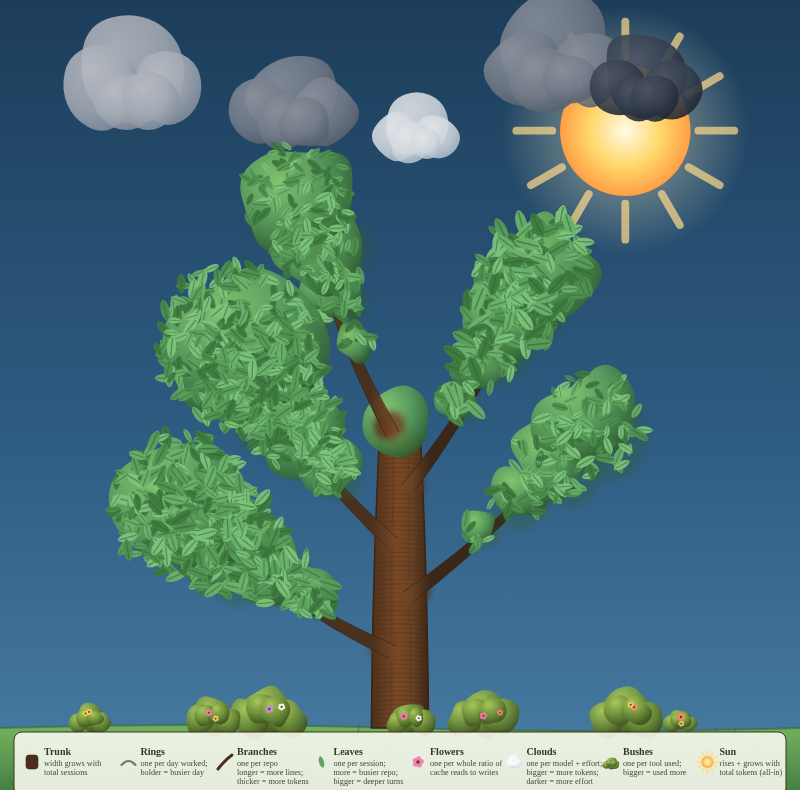

# ccgarden

Grow a garden from your local Claude Code session history.

`ccgarden` reads the JSONL transcripts under `~/.claude/projects`, rolls
them up into a small sqlite history db, and renders the result as an SVG
tree: one growing organism that represents everything you've built with
Claude Code on this machine.



*(This is a dummied-up example with a few months of synthetic data across
five repos, several models, and a handful of tools — enough to show every
shape the renderer draws. Your own garden will look sparser at first and
fill in as you work.)*

## What each shape means

| Shape | Grows with |
|---|---|
| **Trunk** | Total sessions, across all repos |
| **Rings** | One per day worked; bolder rings mean busier days |
| **Branches** | One per repo — longer branches mean more lines changed, thicker branches mean more tokens |
| **Leaves** | One per session; more leaves means a busier repo, bigger leaves mean deeper (more turns/session) sessions |
| **Flowers** | One per whole ratio of cache reads to cache writes |
| **Clouds** | One per model + reasoning-effort combination used; bigger and darker clouds mean more tokens and heavier thinking |
| **Sun** | Rises and brightens with your all-in token total (output + input + cache read + cache write) |
| **Bushes** | One per tool (Bash, Edit, Read, ...); bigger bushes mean more calls |
| **Sunflowers** | One per repo; taller stalks mean more prompts |
| **Sky** | Darkens toward night with the share of prompts you type after 22:00 — stars come out for a committed night owl |
| **Season** | Leaves turn gold and thin out the longer the garden goes untended, and green back up when you return |
| **Birds** | One per `cartoon` adapter that saved tokens; bigger birds mean more tokens saved. Only appears if `cartoon` is installed |

Hover (or tap, on mobile) any shape for the exact numbers behind it.

## Install

```sh
uv tool install ccgarden
```

(or `pipx install ccgarden`). This installs two commands: `ccgarden` and
`ccstats`.

To hack on it instead, clone the repo and run `uv sync`, which puts the
same two commands in the project's virtualenv.

## Usage

```sh
uv run ccgarden
```

This will:

1. Scan `~/.claude/projects` and record today's snapshot into
   `~/.claude/ccstats.db` (same as running `ccstats` — see below).
2. Replay the full day-by-day history from that db into an animated
   SVG timelapse of the garden growing.
3. Write it to `~/.claude/ccgarden.svg` and open it in your browser
   (add `--no-open` to skip that last step).

Run it again any day and the garden picks up where it left off — new
rings, longer branches, bigger clouds, more leaves.

#### Options

| Flag | Effect |
|---|---|
| `--no-open` | write the SVG without opening a browser |
| `-o`, `--output PATH` | where to write the SVG |
| `--db PATH` | which stats db to render from |
| `--log-root DIR` | transcript root to record from (repeatable) |
| `--static` | render one still garden instead of the timelapse |
| `--since`, `--until` | limit the garden to a date range |
| `--no-record` | render the db as-is, skipping today's snapshot |
| `--version` | print the installed version |

So a still image of just this year's garden, written somewhere else and
without touching the db, is:

```sh
ccgarden --static --since 2026-01-01 --no-record --no-open -o garden.svg
```

### `ccstats`

The underlying stats engine can also be run on its own, for a
terminal-native usage report instead of (or before) rendering a garden:

```sh
uv run ccstats                       # summarize all local session logs
uv run ccstats --since 2026-06-01    # limit the window
uv run ccstats --json                # machine-readable output
uv run ccstats --record --since 2026-01-01 --until 2026-07-01  # backfill history
```

Run `uv run ccstats --help` for the full list of flags.

## Development

```sh
uv run pytest
uv run ruff check .
```

## License

MIT — see [LICENSE](LICENSE).
